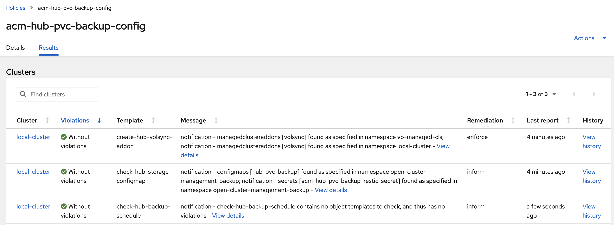
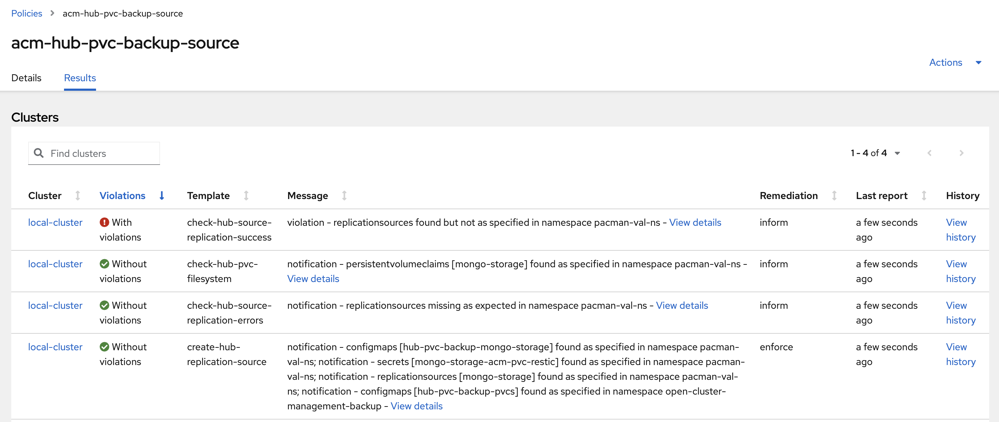

# ACM Hub PersistentVolume backup and restore using VolSync

Hub PersistentVolumeClaim(PVC) backup and restore using VolSync with the Restic-based mover feature. This leverages the Container Storage Interface (CSI) volume snapshot.

Hub PVC with the `cluster.open-cluster-management.io/backup-hub-pvc` label are being backed up and could be restored on another hub using these backup policies. The PVC label's value can be any string.

```yaml
apiVersion: v1
kind: PersistentVolumeClaim
metadata:
  name: global-hub-postgres-0
  namespace: global-hub
  labels:
    cluster.open-cluster-management.io/backup-hub-pvc: gh
spec:
```

------

- [List of PolicySets](#list-of-policysets)
- [List of Policies](#list-of-policies)
- [Policies configuration files](#policies-configuration-files)
  - [Backup hub policies](#backup-hub-policies)
  - [Restore hub policies](#restore-hub-policies)
- [Scenario](#scenario)
- [References](#references)

------


## List of PolicySets 

PolicySet   | Description 
-------------------------------------------| ----------- 
[acm-hub-pvc-backup-policyset](./acm-hub-pvc-backup-policyset.yaml)   | This PolicySet is used to place the backup policies on the hub, using the placement which matches the `local-cluster` or any managed cluster with the `is-hub=true` label. Using this label the policy can be placed on any managed cluster where the ACM operator is installed.


## List of Policies 

Policy      | Description 
-------------------------------------------| ----------- 
[acm-hub-pvc-backup-config](./acm-hub-pvc-backup-config.yaml)                       | Triggered to run on the hub only if the hub has any PVCs with the `cluster.open-cluster-management.io/backup-hub-pvc` label. It installs the volsync-addon on the hub or any managed cluster matching the `acm-hub-pvc-backup-policyset` PolicySet's placement. It reports on policy missing configuration: reports if the user had not create the `acm-hub-pvc-backup-restic-secret` Secret and `hub-pvc-backup` ConfigMap resources under the PolicySet namespace. The Secret is used by volsync to connect to the storage location where the PVC snapshot is stored. The `hub-pvc-backup` ConfigMap is used to define the ReplicationSource configuration, as defined in the [RHACM VolSync documentation](https://access.redhat.com/login?redirectTo=https%3A%2F%2Faccess.redhat.com%2Fdocumentation%2Fen-us%2Fred_hat_advanced_cluster_management_for_kubernetes%2F2.8%2Fhtml%2Fbusiness_continuity%2Fbusiness-cont-overview%23restic-backup-volsync). You can provide a custom configuration file for a PVC by creating the `hub-pvc-backup-pvcns-pvcname` ConfigMap under the PolicySet namespace; this will overwrite the default `hub-pvc-backup` ConfigMap for the specified volume.
[acm-hub-pvc-backup-source](./acm-hub-pvc-backup-source.yaml)                         | Creates a volsync ReplicationSource for all PVCs with the `cluster.open-cluster-management.io/backup-hub-pvc` label. The Policy depends on the `acm-hub-pvc-backup-config` Policy so it only runs if the `acm-hub-pvc-backup-config` Policy is Compliant.
[acm-hub-pvc-backup-destination](./acm-hub-pvc-backup-destination.yaml)                        | In a restore hub backup operation, when the credentials backup is restored on a new hub, it creates a volsync ReplicationDestination for all PVCs with the `cluster.open-cluster-management.io/backup-hub-pvc` label. This is because the  `acm-hub-pvc-backup-source` creates a set of configuration ConfigMaps defining the PVCs for which a snapshot is stored. These ConfigMaps have the `cluster.open-cluster-management.io/backup` backup label so they are backed up by the hub credentials backup. These ConfigMaps are used to recreate the PVCs on the restore hub. On the restore hub, you can use a restore storage config map [class mapping](https://velero.io/docs/main/restore-reference/#changing-pvpvc-storage-classes), when the backup cluster has a different storage class than the restore hub. The Policy depends on the `acm-hub-pvc-backup-config` Policy so it only runs if the `acm-hub-pvc-backup-config` Policy is Compliant.


### Policies 


### Configuration Policy

The `acm-hub-pvc-backup-config` Policy validates the configuration for both types of hubs (backup or restore). If any PVC is found with the `cluster.open-cluster-management.io/backup-hub-pvc` label, it installs the volsync addon and verifies the user has created in the Policy namespace the `acm-hub-pvc-backup-restic-secret` Secret, used to connect to the storage where the VolSync snapshots are saved.It also verifies if the user has created the `hub-pvc-backup` ConfigMap used to define the `ReplicationSource` configuration.



### Backup Hub Policies

Source Policy:



Source Policy Templates:


Policy acm-hub-pvc-backup-destination is not running since this is identified as a backup hub :


### Restore Hub Policies

Backup Destination Policy:


Backup Destination Policy Templates:


Policy acm-hub-pvc-backup-source is not running since this is identified as a restore hub : 


## Policies configuration files


volsync label cluster.open-cluster-management.io/backup-hub-pvc set on PVC

```yaml
kind: PersistentVolumeClaim
apiVersion: v1
metadata:
 name: mongo-storage
 namespace: pacman-restore
 finalizers:
   - kubernetes.io/pvc-protection
 labels:
   cluster.open-cluster-management.io/backup-hub-pvc: pacman-restore
spec:
 accessModes:
   - ReadWriteOnce
 resources:
   requests:
     storage: 8Gi
 volumeName: pvc-3b5b2975-77a4-452f-b14f-8eefed7454a5
 storageClassName: gp3-csi
 volumeMode: Filesystem
```


### Created by the ACM user

#### acm-hub-pvc-backup-config


- Created by the user on the backup hub. 
- Used to define the volsync ReplicationSource configuration, as defined in the [RHACM VolSync documentation](https://access.redhat.com/login?redirectTo=https%3A%2F%2Faccess.redhat.com%2Fdocumentation%2Fen-us%2Fred_hat_advanced_cluster_management_for_kubernetes%2F2.8%2Fhtml%2Fbusiness_continuity%2Fbusiness-cont-overview%23restic-backup-volsync)


```yaml
kind: ConfigMap
apiVersion: v1
metadata:
 name: acm-hub-pvc-backup-config
 namespace: open-cluster-management-backup
 labels:
   cluster.open-cluster-management.io/backup: cluster-activation
data:
 cacheCapacity: 1Gi
 copyMethod: Snapshot
 pruneIntervalDays: '2'
 repository: acm-hub-pvc-backup-restic-secret-vb
 retain_daily: '2'
 retain_hourly: '3'
 retain_monthly: '1'
 trigger_schedule: 0 */2 * * *
```

The above ConfigMap defines global options for all hub PVCs that need to be backed up with the policy. If you want to provide custom
properties for a PVC, you should define a ConfigMap using this name convention : `acm-hub-pvc-backup-config-<pvc-ns>-<pvc-name>` 

For example, if the PVC `my-pvc` created in namespace `ns-1` should be backed up every 5 hours, create this ConfigMap under the `open-cluster-management-backup` namespace :

```yaml
kind: ConfigMap
apiVersion: v1
metadata:
 name: acm-hub-pvc-backup-config-ns-1-my-pvc
 namespace: open-cluster-management-backup
 labels:
   cluster.open-cluster-management.io/backup: cluster-activation
data:
 cacheCapacity: 1Gi
 copyMethod: Snapshot
 pruneIntervalDays: '2'
 repository: acm-hub-pvc-backup-restic-secret
 retain_daily: '2'
 retain_hourly: '3'
 retain_monthly: '1'
 trigger_schedule: 0 */5 * * *
```

#### acm-hub-pvc-backup-restic-secret

Created by the user

Used to define the volsync ReplicationSource configuration, as defined in the [RHACM VolSync documentation](https://access.redhat.com/login?redirectTo=https%3A%2F%2Faccess.redhat.com%2Fdocumentation%2Fen-us%2Fred_hat_advanced_cluster_management_for_kubernetes%2F2.8%2Fhtml%2Fbusiness_continuity%2Fbusiness-cont-overview%23restic-backup-volsync)


```yaml
kind: Secret
apiVersion: v1
metadata:
 name: acm-hub-pvc-backup-restic-secret
 namespace: open-cluster-management-backup
 labels:
   cluster.open-cluster-management.io/backup: volsync
data:
 AWS_ACCESS_KEY_ID: a2V5
 AWS_SECRET_ACCESS_KEY: a2V5
 RESTIC_PASSWORD: a2V5
 RESTIC_REPOSITORY: >-
 czM6aHR0cDovL21pbmlvLm1pbmlvLnN2Yy5jbHVzdGVyLmxvY2FsOjkwMDAvbXktYnVja2V0
type: Opaque
```


### Generated by the policy 

#### acm-hub-pvc-backup-config-info-<pvc_name>

Created by the volsync policy on the backup hub for each PVC using the PVC's settings
This resource is backed up and used by the volsync ReplicationDestination to recreate the PV on the restore hub.

```yaml
kind: ConfigMap
apiVersion: v1
metadata:
 name: acm-hub-pvc-backup-config-info-mongo-storage
 namespace: pacman-ns
 labels:
   cluster.open-cluster-management.io/backup: cluster-activation
data:
 resources.accessModes: ReadWriteOnce
 resources.requests.storage: 8Gi
 storageClassName: gp3-csi
 volumeMode: Filesystem
```

 
#### acm-hub-pvc-backup-config-pvcs

Created by the policy on the backup hub; lists all PVCs that need to be restored. This resource is backed up

```yaml
kind: ConfigMap
apiVersion: v1
metadata:
 name: acm-hub-pvc-backup-config-pvcs
 namespace: open-cluster-management-backup
 labels:
   app: acm-hub-pvc-backup-config-pvcs
   cluster.open-cluster-management.io/backup: cluster-activation
 data:
 pvcs: 'pacman-restore#mongo-storage##pacman-vb#mongo-storage##pacman#mongo-storage'
```


## Scenario

ACM components installed on the hub.
User adds the `cluster.open-cluster-management.io/backup-hub-pvc` label to the PVC to be backed up.


ACM user, on Primary hub:
1. Enables backup on MultiClusterHub. This installs the hub backup component
2. The user manually installs the policy from the community project
3. Creates a BackupSchedule 
  - The volsync policy informs the user if missing the volsync acm-hub-pvc-backup-restic-secret secret and acm-hub-pvc-backup-config ConfigMap 
3. User creates the acm-hub-pvc-backup-restic-secret secret and acm-hub-pvc-backup-config ConfigMap 
4. Policy installs volsync addon on hub and creates the volsync `ReplicationSources` for all PVCs with the volsync label


ACM user, on Restore hub:

5. Enables backup on MultiClusterHub. This installs the hub backup component
  - The user manually installs the policy from the community project
6. Creates an ACM Restore resource and restores active data
  - The policy creates the volsync `ReplicationDestination` for all PVCs defined in the restored acm-hub-pvc-backup-config-pvcs ConfigMap
  - the app using the PVC must be restored after the PVC is created so make sure these resources are restored at cluster activation time.  

## References
- [RHACM Volsync documentation](https://access.redhat.com/login?redirectTo=https%3A%2F%2Faccess.redhat.com%2Fdocumentation%2Fen-us%2Fred_hat_advanced_cluster_management_for_kubernetes%2F2.8%2Fhtml%2Fbusiness_continuity%2Fbusiness-cont-overview%23restic-backup-volsync)

