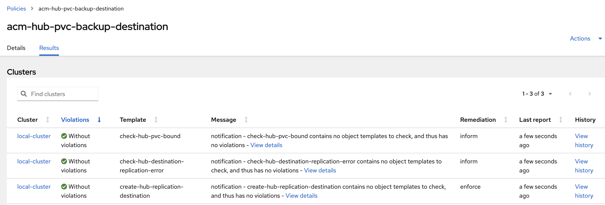
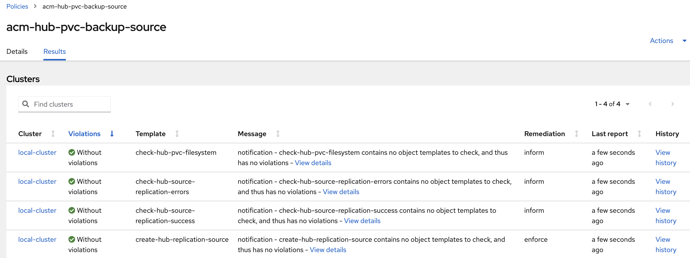

# ACM Hub PersistentVolume backup and restore using VolSync

Hub PersistentVolumeClaim(PVC) backup and restore using VolSync with the Restic-based mover feature. This leverages the Container Storage Interface (CSI) volume snapshot.

Hub PVC with the `cluster.open-cluster-management.io/backup-hub-pvc` label are being backed up and could be restored on another hub using these backup policies. The PVC label's value can be any string.

```yaml
apiVersion: v1
kind: PersistentVolumeClaim
metadata:
  name: global-hub-postgres-0
  namespace: global-hub
  labels:
    cluster.open-cluster-management.io/backup-hub-pvc: gh
spec:
```

------

- [List of PolicySets](#list-of-policysets)
- [List of Policies](#list-of-policies)
- [Policies configuration files](#policies-configuration-files)
  - [Backup hub policies](#backup-hub-policies)
  - [Restore hub policies](#restore-hub-policies)
- [Scenario](#scenario)
- [References](#references)

------


## List of PolicySets 

PolicySet   | Description 
-------------------------------------------| ----------- 
[acm-hub-pvc-backup-policyset](./acm-hub-pvc-backup-policyset.yaml)   | This PolicySet is used to place the backup policies on the hub, using the placement which matches the `local-cluster` or any managed cluster with the `is-hub=true` label. Using this label the policy can be placed on any managed cluster where the ACM operator is installed.


## List of Policies 

Policy      | Description 
-------------------------------------------| ----------- 
[acm-hub-pvc-backup-config](./acm-hub-pvc-backup-config.yaml)                       | Triggered to run on the hub only if the hub has any PVCs with the `cluster.open-cluster-management.io/backup-hub-pvc` label. It installs the volsync-addon on the hub or any managed cluster matching the `acm-hub-pvc-backup-policyset` PolicySet's placement. It reports on policy missing configuration: reports if the user had not create the `acm-hub-pvc-backup-restic-secret` Secret and `hub-pvc-backup` ConfigMap resources under the PolicySet namespace. The Secret is used by volsync to connect to the storage location where the PVC snapshot is stored. The `hub-pvc-backup` ConfigMap is used to define the ReplicationSource configuration, as defined in the [RHACM VolSync documentation](https://access.redhat.com/login?redirectTo=https%3A%2F%2Faccess.redhat.com%2Fdocumentation%2Fen-us%2Fred_hat_advanced_cluster_management_for_kubernetes%2F2.8%2Fhtml%2Fbusiness_continuity%2Fbusiness-cont-overview%23restic-backup-volsync). You can provide a custom configuration file for a PVC by creating the `hub-pvc-backup-pvcns-pvcname` ConfigMap under the PolicySet namespace; this will overwrite the default `hub-pvc-backup` ConfigMap for the specified volume.
[acm-hub-pvc-backup-source](./acm-hub-pvc-backup-source.yaml)                         | Creates a volsync ReplicationSource for all PVCs with the `cluster.open-cluster-management.io/backup-hub-pvc` label. The Policy depends on the `acm-hub-pvc-backup-config` Policy so it only runs if the `acm-hub-pvc-backup-config` Policy is Compliant.
[acm-hub-pvc-backup-destination](./acm-hub-pvc-backup-destination.yaml)                        | In a restore hub backup operation, when the credentials backup is restored on a new hub, it creates a volsync ReplicationDestination for all PVCs with the `cluster.open-cluster-management.io/backup-hub-pvc` label. This is because the  `acm-hub-pvc-backup-source` creates a set of configuration ConfigMaps defining the PVCs for which a snapshot is stored. These ConfigMaps have the `cluster.open-cluster-management.io/backup` backup label so they are backed up by the hub credentials backup. The Policy depends on the `acm-hub-pvc-backup-config` Policy so it only runs if the `acm-hub-pvc-backup-config` Policy is Compliant.


### Policies 


### Configuration Policy

The `acm-hub-pvc-backup-config` Policy validates the configuration for both types of hubs (backup or restore). If any PVC is found with the `cluster.open-cluster-management.io/backup-hub-pvc` label, it installs the volsync addon and verifies the user has created in the Policy namespace the `acm-hub-pvc-backup-restic-secret` Secret, used to connect to the storage where the VolSync snapshots are saved.It also verifies if the user has created the `hub-pvc-backup` ConfigMap used to define the `ReplicationSource` configuration.


### Backup Hub Policies

Source Policy:


Source Policy Templates:


Policy acm-hub-pvc-backup-destination is not running since this is identified as a backup hub :



### Restore Hub Policies

Backup Destination Policy:


Backup Destination Policy Templates:


Policy acm-hub-pvc-backup-source is not running since this is identified as a restore hub : 



## Policies configuration files


volsync label cluster.open-cluster-management.io/backup-hub-pvc set on PVC

```yaml
kind: PersistentVolumeClaim
apiVersion: v1
metadata:
 name: mongo-storage
 namespace: pacman-restore
 finalizers:
   - kubernetes.io/pvc-protection
 labels:
   cluster.open-cluster-management.io/backup-hub-pvc: pacman-restore
spec:
 accessModes:
   - ReadWriteOnce
 resources:
   requests:
     storage: 8Gi
 volumeName: pvc-3b5b2975-77a4-452f-b14f-8eefed7454a5
 storageClassName: gp3-csi
 volumeMode: Filesystem
```


### Created by the ACM user

#### hub-pvc-backup


- Created by the user on the backup hub. 
- Used to define the volsync ReplicationSource configuration, as defined in the [RHACM VolSync documentation](https://access.redhat.com/login?redirectTo=https%3A%2F%2Faccess.redhat.com%2Fdocumentation%2Fen-us%2Fred_hat_advanced_cluster_management_for_kubernetes%2F2.8%2Fhtml%2Fbusiness_continuity%2Fbusiness-cont-overview%23restic-backup-volsync)


The `hub-pvc-backup` ConfigMap has the following format: 


```yaml
kind: ConfigMap
apiVersion: v1
metadata:
 name: hub-pvc-backup
 namespace: open-cluster-management-backup
 labels:
   cluster.open-cluster-management.io/backup: cluster-activation
data:
 cacheCapacity: 2Gi
 retain_last: '5'
 trigger_schedule: 20 */1 * * *
```

Mandatory properties set with the `hub-pvc-backup` ConfigMap: 


- trigger_schedule : The trigger_schedule property is a required property. Use it  and is used to set the ReplicationSource spec.trigger.schedule property as a cron schedule


Optional properties set with the `hub-pvc-backup` ConfigMap:

- The `cacheCapacity` and `pruneIntervalDays` are optional properties. Use them to  and are used to set the VolSync ReplicationSource `spec.restic.cacheCapacity` and `spec.restic.pruneIntervalDays` spec options. VolSync defaults `spec.restic.cacheCapacity` to 1Gi if you have not specified the capacity limit. VolSync defaults to 7 days if you have not specified `spec.restic.pruneIntervalDays`.
- The `retain_daily`, `retain_hourly`, `retain_weekly`, `retain_monthly`, `retain_yearly`, `retain_last`, `retain_within` properties are optional. Use them to set the VolSync ReplicationSource restic retain(daily, hourly, monthly and weekly, last, within) properties. The retain policy options are optional. VolSync defaults to "keep last 1" if you did not specify the amount to keep.

You can set a spec.restic.customCA ReplicationSource property, using the following ConfigMap properties:

```yaml
kind: ConfigMap
apiVersion: v1
metadata:
 name: hub-pvc-backup
 namespace: open-cluster-management-backup
 labels:
   cluster.open-cluster-management.io/backup: cluster-activation
data:
 customCA_secretName: tls-secret
 customCA_configMapName: tls-configmap-name
 customCA_key: ca.crt
```

You can set the `spec.restic.storageClassName` and `spec.restic.volumeSnapshotClassName`,`spec.restic.cacheStorageClassName`, `spec.restic.capacity`,  `spec.restic.accessMode`, `spec.restic.cacheAccessMode` for the ReplicationSource resource using the following ConfigMap properties:

```yaml
kind: ConfigMap
apiVersion: v1
metadata:
 name: hub-pvc-backup
 namespace: open-cluster-management-backup
 labels:
   cluster.open-cluster-management.io/backup: cluster-activation
data:
 storageClassName: my-sc-name
 volumeSnapshotClassName: my-vsc-name
 cacheStorageClassName: my-vsc-name
 capacity: 3Gi  
 accessModes:
mode
cacheAccessModes:
  - mode
 ```
 

The customCA option  is documented here https://volsync.readthedocs.io/en/v0.9.0/usage/restic/index.html#using-a-custom-certificate-authority 


The VolSync ReplicationSource will be created automatically by the policy.  For more information about the specific fields above, refer to the VolSync documentation https://volsync.readthedocs.io/en/v0.9.0/usage/restic/index.html#configuring-backup


The above ConfigMap defines global options for all hub PVCs that need to be backed up with the policy. If you want to provide custom
properties for a PVC, you should define a ConfigMap using this name convention : `hub-pvc-backup-<pvc-ns>-<pvc-name>` 

For example, if the PVC `my-pvc` created in namespace `ns-1` should be backed up every 5 hours, create this ConfigMap under the `open-cluster-management-backup` namespace :

```yaml
kind: ConfigMap
apiVersion: v1
metadata:
 name: hub-pvc-backup-ns-1-my-pvc
 namespace: open-cluster-management-backup
 labels:
   cluster.open-cluster-management.io/backup: cluster-activation
data:
 cacheCapacity: 1Gi
 copyMethod: Snapshot
 pruneIntervalDays: '2'
 repository: acm-hub-pvc-backup-restic-secret
 retain_daily: '2'
 retain_hourly: '3'
 retain_monthly: '1'
 trigger_schedule: 0 */5 * * *
```


#### acm-hub-pvc-backup-restic-secret

Created by the user

Used to define the volsync ReplicationSource configuration, as defined in the [RHACM VolSync documentation](https://access.redhat.com/login?redirectTo=https%3A%2F%2Faccess.redhat.com%2Fdocumentation%2Fen-us%2Fred_hat_advanced_cluster_management_for_kubernetes%2F2.8%2Fhtml%2Fbusiness_continuity%2Fbusiness-cont-overview%23restic-backup-volsync)


```yaml
kind: Secret
apiVersion: v1
metadata:
 name: acm-hub-pvc-backup-restic-secret
 namespace: open-cluster-management-backup
 labels:
   cluster.open-cluster-management.io/backup: cluster-activation
data:
 AWS_ACCESS_KEY_ID: a2V5
 AWS_SECRET_ACCESS_KEY: a2V5
 RESTIC_PASSWORD: a2V5
 RESTIC_REPOSITORY: >-
 czM6aHR0cDovL21pbmlvLm1pbmlvLnN2Yy5jbHVzdGVyLmxvY2FsOjkwMDAvbXktYnVja2V0
type: Opaque
```


### Generated by the policy 

#### hub-pvc-backup-<pvc_name>

Created by the volsync policy on the backup hub for each PVC using the PVC's settings
This resource is backed up and used by the volsync ReplicationDestination to recreate the PV on the restore hub.

```yaml
kind: ConfigMap
apiVersion: v1
metadata:
 name: hub-pvc-backup-mongo-storage
 namespace: pacman-ns
 labels:
   cluster.open-cluster-management.io/backup: cluster-activation
data:
 resources.accessModes: ReadWriteOnce
 resources.requests.storage: 8Gi
 storageClassName: gp3-csi
 volumeMode: Filesystem
```

 
#### hub-pvc-backup-pvcs

Created by the policy on the backup hub; lists all PVCs that need to be restored. This resource is backed up

```yaml
kind: ConfigMap
apiVersion: v1
metadata:
 name: hub-pvc-backup-pvcs
 namespace: open-cluster-management-backup
 labels:
   app: hub-pvc-backup-pvcs
   cluster.open-cluster-management.io/backup: cluster-activation
 data:
 pvcs: 'pacman-restore#mongo-storage##pacman-vb#mongo-storage##pacman#mongo-storage'
```

## hub-pvc-restore ConfigMap

The `hub-pvc-restore` ConfigMap is an optional resource that you can define on the hub where you store the PVC. The following includes some benefits of creating a hub-pvc-restore ConfigMap:
- You want to overwrite the VolSync ReplicationDestination resource properties which are provided by the hub-pvc-backup-<pvc-name> ConfigMaps. For example, the hub-pvc-backup-<pvc-name> sets the spec.requests.storage: 8Gi because the backed up PVC spec.requests.storage value was 8Gi. You want to overwrite the value and use spec.requests.storage: 10Gi for the PVC which gets created on the restore hub. 
- You want to set PVC spec values on the restored PVC which were not set on the initial PVC

If you use this ConfigMap for a restore operation, you must create the `hub-pvc-restore` ConfigMap under the `open-cluster-management-backup` namespace, before the ACM Restore.cluster.open-cluster-management.io resource runs. This way, the backup-pvc-destination policy starts creating the PVC resource.

The configuration defined by the hub-pvc-restore ConfigMap is used by all VolSync ReplicationDestination resources as a global configuration. It supersedes any property defined by the initial PVC.


The `hub-pvc-restore` ConfigMap is in the following format:

```yaml
kind: ConfigMap
apiVersion: v1
metadata:
 name: hub-pvc-restore
 namespace: open-cluster-management-backup
data:
 accessModes: ReadWriteOnce
 capacity: 8Gi 
 storageClassName: gp3-csi
 customCA_secretName: tls-secret
 customCA_configMapName:tls-configmap-name
 customCA_key: ca.crt
 cacheAccessModes: ReadWriteOnce
 cacheCapacity: 11Gi
 cacheStorageClassName: cls_name
 previous: '7'
 volumeSnapshotClassName: cls_name
 restoreAsOf: timestamp
 ```


## Customizing a ReplicationDestination configuration

Customize the ReplicationDestination configuration to meet your specific backup and restore needs. To customize a configuration file, complete the following steps: 


- Go to the open-cluster-management-backup namespace.
- Create the hub-pvc-restore-pvcns-pvc-name ConfigMap.
- Provide a custom hub-pvc-restore ConfigMap file for a PVC with a cluster.open-cluster-management.io/backup-hub-pvc label. 
- Notice that the ConfigMap overwrites the specified PVC with the default values defined by the hub-pvc-restore ConfigMap.
- Specify the specific ConfigMap for the PVC. 
- If you define a hub-pvc-restore-pvcns-pvc-name ConfigMap, the  hub-pvc-restore ConfigMap is ignored for a PVC and its corresponding ReplcationDestination Volsync resource.   


## Restoring Snapshots from a different location

You might need to copy the backed up PVC data to a different storage location then use this location when a recovery action is run on the restore hub. 
You would need to do this if the restore hub is not able to access the backup storage location.

In this case, to restore the PVC from a different location than the backup location specified with the acm-hub-pvc-backup-restic-secret Secret, you must complete the following steps:

1. On the restore hub, go to the open-cluster-management-backup namespace.
2. Create a `acm-hub-pvc-restore-restic-secret` Secret in the same format as the `acm-hub-pvc-backup-restic-secret` Secret.
3. Setup the Secret to your desired location and, from where the PVC should be restored.
4. Run the ACM Restore operation. During the restore operation, when the backup-pvc-destination Policy finds the `acm-hub-pvc-restore-restic-secret` Secret, it uses it to access the PVC snapshots, instead of the `acm-hub-pvc-backup-restic-secret` Secret.

NOTE: Note: Once  When the restore operation is completed and this cluster becomes the active hub, you  might need to update the `acm-hub-pvc-backup-restic-secret` Secret with the `acm-hub-pvc-restore-restic-secret` storage location since the PVC are backed up at the location defined by the `acm-hub-pvc-backup-restic-secret` Secret.


## VolSync hooks for pre and post snapshot operation

When you use the policies to take a backup of the PVC data, a CSI VolumeSnapshot is taken of the PVC by VolSync before each time it is backed up.  This snapshot ensures that a point-in-time copy of the PVC is backed up instead of copying from the live PVC directly.

You might need to prepare the PVC before a snapshot is executed and resume the PVC usage after the snapshot is completed. For this, use the annotations on the PVC provided by VolSync to help you:
- coordinate when VolSync should take the snapshot
- indicate when the snapshot has been taken
- decide to run pre or post snapshot operations

For more information about PVC snapshot annotations, see the VolSync docs: https://volsync.readthedocs.io/en/v0.9.0/usage/pvccopytriggers.html


## Scenario

ACM components installed on the hub.
User adds the `cluster.open-cluster-management.io/backup-hub-pvc` label to the PVC to be backed up.


ACM user, on Primary hub:
1. Enables backup on MultiClusterHub. This installs the hub backup component
2. The user manually installs the policy from the community project
3. Creates a BackupSchedule 
  - The volsync policy informs the user if missing the volsync acm-hub-pvc-backup-restic-secret secret and acm-hub-pvc-backup-config ConfigMap 
3. User creates the acm-hub-pvc-backup-restic-secret secret and acm-hub-pvc-backup-config ConfigMap 
4. Policy installs volsync addon on hub and creates the volsync `ReplicationSources` for all PVCs with the volsync label


ACM user, on Restore hub:

5. Enables backup on MultiClusterHub. This installs the hub backup component
  - The user manually installs the policy from the community project
6. Creates an ACM Restore resource and restores active data
  - The policy creates the volsync `ReplicationDestination` for all PVCs defined in the restored acm-hub-pvc-backup-config-pvcs ConfigMap
  - the app using the PVC must be restored after the PVC is created so make sure these resources are restored at cluster activation time.  


## References
- [RHACM Volsync documentation](https://access.redhat.com/login?redirectTo=https%3A%2F%2Faccess.redhat.com%2Fdocumentation%2Fen-us%2Fred_hat_advanced_cluster_management_for_kubernetes%2F2.8%2Fhtml%2Fbusiness_continuity%2Fbusiness-cont-overview%23restic-backup-volsync)

