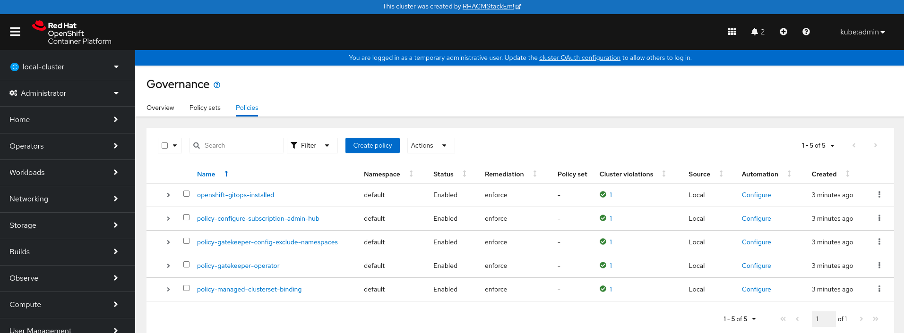
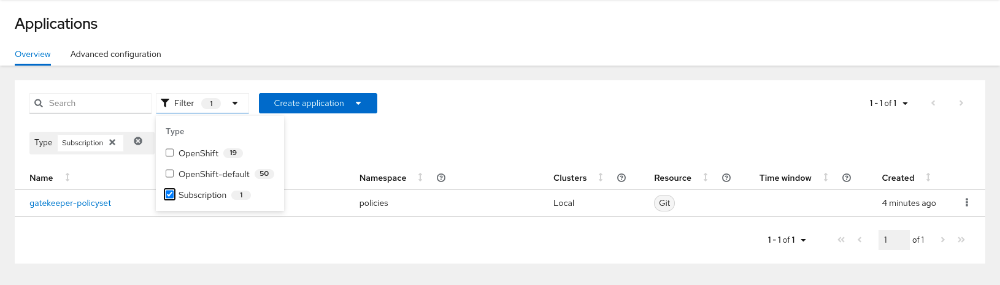
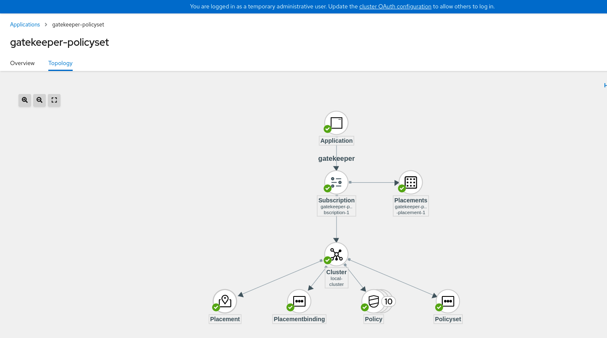
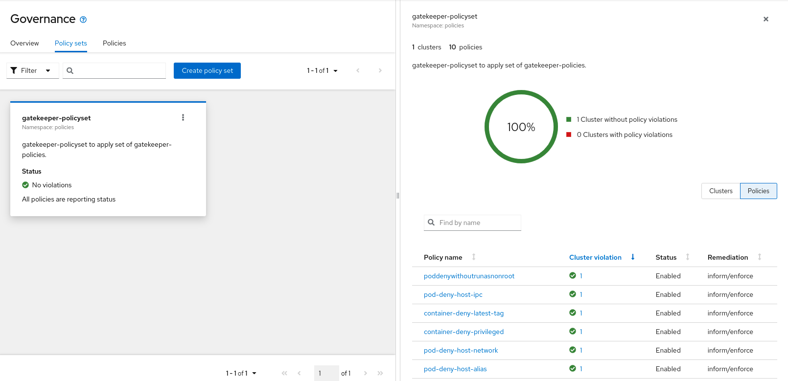
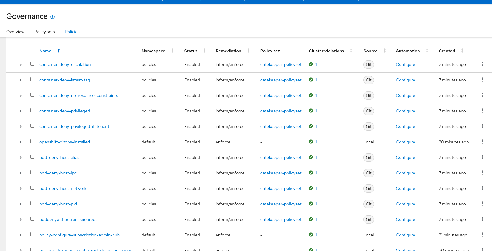

## PolicySets for integrating Gatekeeper into Open Cluster Management

This Policysets cover:

- Container Security 

the examples are based on:  https://github.com/plexsystems/konstraint/tree/main/examples

## Further notes on installation.

When using Open Cluster Management Subscriptions and Placement we strongly recommend to install the following policies before you apply the Policy (Policies need to be set to enforce).
**Note** Be sure to install the policies into an appropriate namespace such as `policies`.

```
oc project policies
oc apply -f https://raw.githubusercontent.com/open-cluster-management-io/policy-collection/main/community/CM-Configuration-Management/policy-configure-subscription-admin-hub.yaml
oc apply -f https://raw.githubusercontent.com/open-cluster-management-io/policy-collection/main/community/CM-Configuration-Management/policy-managedclustersetbinding.yaml
oc apply -f https://raw.githubusercontent.com/open-cluster-management-io/policy-collection/main/community/CM-Configuration-Management/policy-openshift-gitops.yaml
oc apply -f https://raw.githubusercontent.com/open-cluster-management-io/policy-collection/main/community/CM-Configuration-Management/policy-gatekeeper-config-exclude-namespaces.yaml
oc apply -f https://raw.githubusercontent.com/open-cluster-management-io/policy-collection/main/stable/CM-Configuration-Management/policy-gatekeeper-operator-downstream.yaml
```

Ensure that the Policies are applied to the Hub-Cluster, you might review the `PlacementRule` labels 
like `environment=dev`.


The Policies should look like this in the UI.



Now you can create the Gatekeeper Policy Applications where the Application corresponds to the path under `policy-generator/policy-sets/community/gatekeeper`.
**NOTE** Policy applications must always be deployed only to the Open Cluster Management hub managed cluster named `local-cluster`. Policy applications contain an additional placement resource that must be modified to control where the policies are distributed.




Topology View



PolicySet View



Policies View




  

## Notes on Kustomization

We provide an input-folder where all the Gatekeeper-Policies will be stored.
So this can be easily customized. 


# Gatekeeper Policyset focused on Security Checks


## List of Policies 


Policy                                  | Description 
----------------------------------------| ----------- 
container-deny-escalation               | A container should not allow privilege escalation
container-deny-latest-tag               | A container should not have a latest tag
container-deny-no-resource-constraints  | A container should have resource contraints
container-deny-privileged               | Containers must not run as privileged
pod-deny-host-alias                     | Pods that can change aliases in the host's /etc/hosts file can redirect traffic to malicious servers.
pod-deny-host-ipc                       | Pods that are allowed to access the host IPC can read memory of the other containers, breaking that security boundary.
pod-deny-host-network                   | Pods that can access the host's network interfaces can potentially access and tamper with traffic the pod should not have access to.
pod-deny-host-pid                       | Pods that can access the host's process tree can view and attempt to modify processes outside of their namespace, breaking that security
pod-deny-without-runasnonroot           | Pods running as root (uid of 0) can much more easily escalate privileges to root on the node. As such, they are not allowed.


