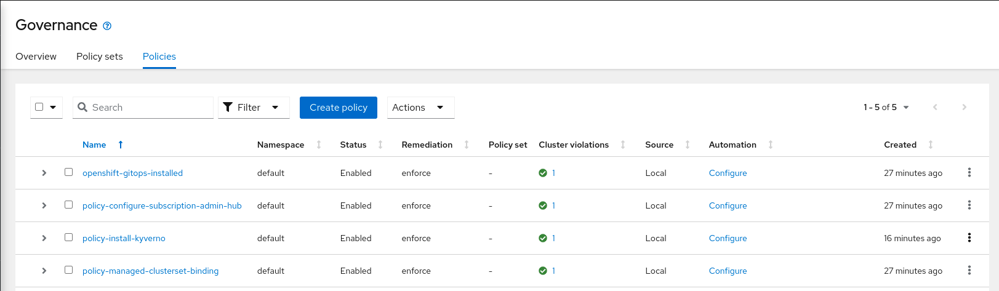
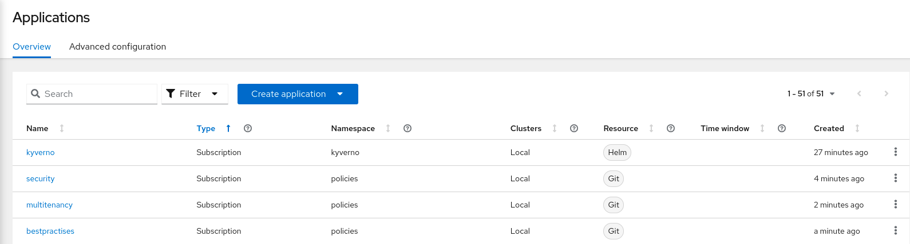
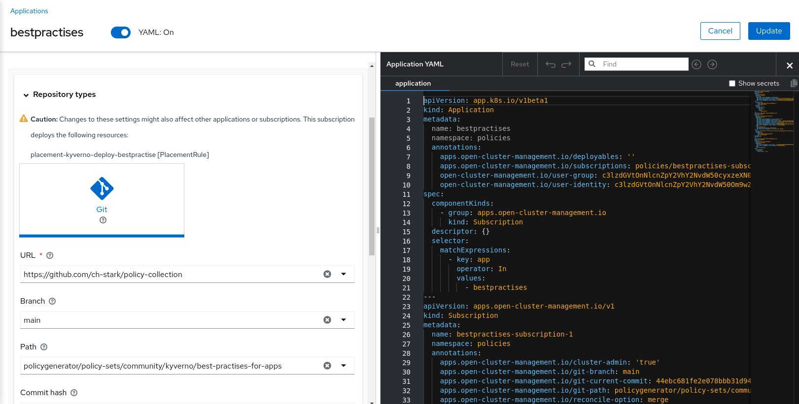
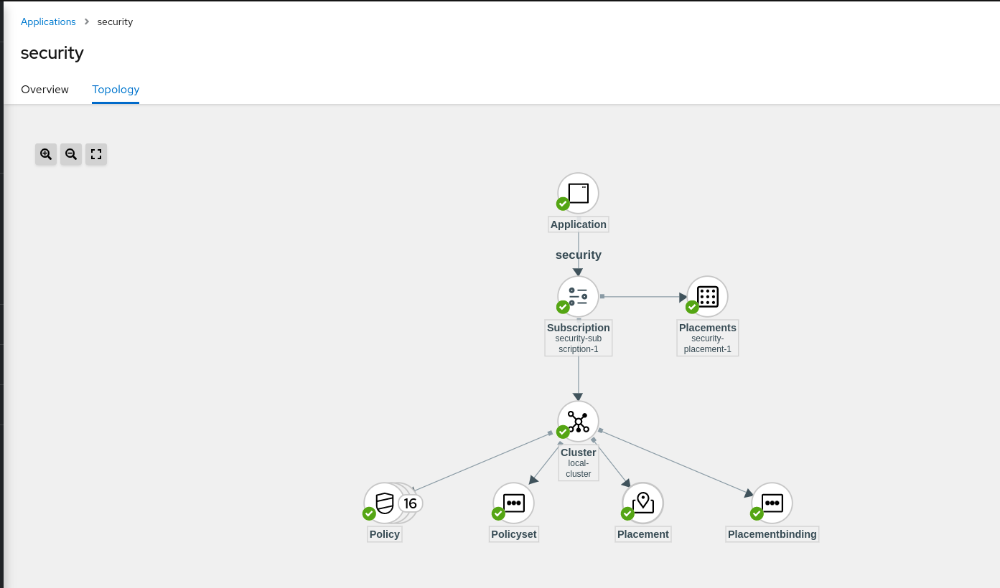
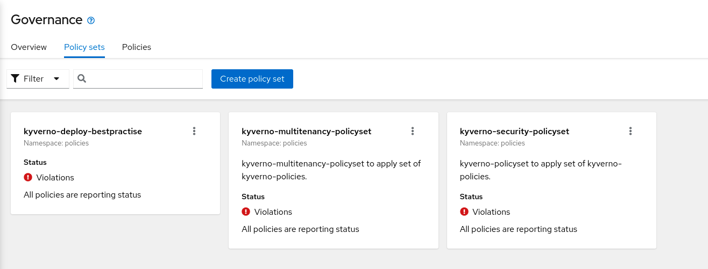
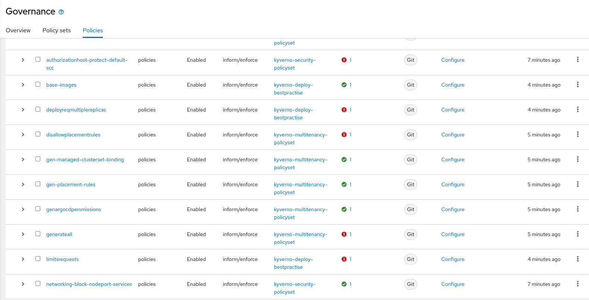

## PolicySets for integrating Kyverno into Open Cluster Management

The three Policysets cover:

- Security 
- Best practices 
- Multitenancy 


## Further notes on installation.

When using Open Cluster Management Subscriptions and Placement we strongly recommend to install the following policies before you apply the Policy (Policies need to be set to enforce)

```
oc apply -f https://raw.githubusercontent.com/open-cluster-management-io/policy-collection/main/community/CM-Configuration-Management/policy-configure-subscription-admin-hub.yaml
oc apply -f https://raw.githubusercontent.com/open-cluster-management-io/policy-collection/main/community/CM-Configuration-Management/policy-managedclustersetbinding.yaml
oc apply -f https://raw.githubusercontent.com/open-cluster-management-io/policy-collection/main/community/CM-Configuration-Management/policy-openshift-gitops.yaml
oc apply -f https://raw.githubusercontent.com/open-cluster-management-io/policy-collection/main/community/CM-Configuration-Management/policy-install-kyverno.yaml
oc apply -f https://raw.githubusercontent.com/open-cluster-management-io/policy-collection/main/community/CM-Configuration-Management/policy-kyverno-config-exclude-resources.yaml
```

Ensure that the Policies are applied to the Hub-Cluster, you might review the labels like `environment=dev`


The Policies should look like this in the UI.



Now you can create three Applications in Open Cluster Management where every Application corresponds to a path under `policy-sets/community/kyverno`



Configuring Applications (using a fork of Policy-Collection-Repo)



Topology View



PolicySet View



Policies View




## Inspecting a Policy which is not compliant


```
apiVersion: wgpolicyk8s.io/v1alpha2
kind: PolicyReport
metadata:
  creationTimestamp: '2022-08-17T14:04:41Z'
  generation: 8
  labels:
    managed-by: kyverno
    name: polr-ns-openshift-authentication-operator
  namespace: openshift-authentication-operator
  ownerReferences:
    - apiVersion: v1
      controller: true
      kind: Namespace
      name: kyverno
      uid: e09c6d79-9505-4fca-aa92-48d8fffb5216
  resourceVersion: '275755'
  uid: 459d7486-4d27-4bf6-9eaf-f33432159c94
results:
  - category: Security
    message: >-
      validation error: Binding to cluster-admin is not allowed. Rule
      clusteradmin-bindings failed at path /roleRef/
    policy: restrict-binding-clusteradmin
    resources:
      - apiVersion: rbac.authorization.k8s.io/v1
        kind: RoleBinding
        name: system:image-builders
        namespace: openshift-authentication-operator
        uid: a5d5aaca-e821-4853-a78b-32627c265fb7
    result: fail
    rule: clusteradmin-bindings
    scored: true
    severity: medium
    source: Kyverno
    timestamp:
      nanos: 0
      seconds: 1660745099
  - category: Sample
    message: >-
      validation error: Setting the nodeSelector field is prohibited. Rule
      autogen-restrict-nodeselector failed at path
      /spec/template/spec/nodeSelector/
    policy: restrict-node-selection
    resources:
      - apiVersion: apps/v1
        kind: Deployment
        name: authentication-operator
        namespace: openshift-authentication-operator
        uid: 47530264-68b1-479b-9a92-ab94929c8047
    result: fail
    rule: autogen-restrict-nodeselector
    scored: true
    source: Kyverno
    timestamp:
      nanos: 0
      seconds: 1660745126
  - category: Other
    message: >-
      validation error: Ports must be between 32000-33000. Rule
      restrict-port-range failed at path /spec/ports/0/port/
    policy: restrict-service-port-range
    resources:
      - apiVersion: v1
        kind: Service
        name: metrics
        namespace: openshift-authentication-operator
        uid: d0ebe6f9-0f2e-4dd8-b40b-04545194a00a
    result: fail
    rule: restrict-port-range
    scored: true
    severity: medium
    source: Kyverno
    timestamp:
      nanos: 0
      seconds: 1660745131
  - category: Sample
    message: validation rule 'no-LoadBalancer' passed.
    policy: no-loadbalancer-service
    resources:
      - apiVersion: v1
        kind: Service
        name: metrics
        namespace: openshift-authentication-operator
        uid: d0ebe6f9-0f2e-4dd8-b40b-04545194a00a
    result: pass
    rule: no-LoadBalancer
    scored: true
    severity: medium
    source: Kyverno
    timestamp:
      nanos: 0
      seconds: 1660745110
  - category: Other
    message: >-
      failed to load context: failed to retrieve config map for context entry
      baseimages: failed to get configmap platform/baseimages : configmaps
      "baseimages" not found
    policy: allowed-base-images
    resources:
      - apiVersion: apps/v1
        kind: Deployment
        name: authentication-operator
        namespace: openshift-authentication-operator
        uid: 47530264-68b1-479b-9a92-ab94929c8047
    result: error
    rule: autogen-check-base-image
    scored: true
    severity: medium
    source: Kyverno
    timestamp:
      nanos: 0
      seconds: 1660745303
  - category: Best Practices
    message: >-
      validation error: CPU and memory resource requests and limits are
      required. Rule autogen-validate-resources failed at path
      /spec/template/spec/containers/0/resources/limits/
    policy: require-requests-limits
    resources:
      - apiVersion: apps/v1
        kind: Deployment
        name: authentication-operator
        namespace: openshift-authentication-operator
        uid: 47530264-68b1-479b-9a92-ab94929c8047
    result: fail
    rule: autogen-validate-resources
    scored: true
    severity: medium
    source: Kyverno
    timestamp:
      nanos: 0
      seconds: 1660745315
  - category: Sample
    message: >-
      validation error: Deployments should have more than one replica to ensure
      availability. Rule deployment-has-multiple-replicas failed at path
      /spec/replicas/
    policy: deployment-has-multiple-replicas
    resources:
      - apiVersion: apps/v1
        kind: Deployment
        name: authentication-operator
        namespace: openshift-authentication-operator
        uid: 47530264-68b1-479b-9a92-ab94929c8047
    result: fail
    rule: deployment-has-multiple-replicas
    scored: true
    severity: medium
    source: Kyverno
    timestamp:
      nanos: 0
      seconds: 1660745337
  - category: Security
    message: >-
      validation error: Binding to cluster-admin is not allowed. Rule
      clusteradmin-bindings failed at path /roleRef/
    policy: restrict-binding-clusteradmin
    resources:
      - apiVersion: rbac.authorization.k8s.io/v1
        kind: RoleBinding
        name: prometheus-k8s
        namespace: openshift-authentication-operator
        uid: c98bc4f3-f46d-4a98-94a1-a1262bc4f23d
    result: fail
    rule: clusteradmin-bindings
    scored: true
    severity: medium
    source: Kyverno
    timestamp:
      nanos: 0
      seconds: 1660745099
  - category: Sample
    message: validation rule 'block-flux-v1' passed.
    policy: restrict-annotations
    resources:
      - apiVersion: apps/v1
        kind: Deployment
        name: authentication-operator
        namespace: openshift-authentication-operator
        uid: 47530264-68b1-479b-9a92-ab94929c8047
    result: pass
    rule: block-flux-v1
    scored: true
    source: Kyverno
    timestamp:
      nanos: 0
      seconds: 1660745109
  - category: Security
    message: >-
      validation error: Binding to cluster-admin is not allowed. Rule
      clusteradmin-bindings failed at path /roleRef/
    policy: restrict-binding-clusteradmin
    resources:
      - apiVersion: rbac.authorization.k8s.io/v1
        kind: RoleBinding
        name: system:deployers
        namespace: openshift-authentication-operator
        uid: eb08aa6b-c5f5-48df-afda-f3acf8afe2b7
    result: fail
    rule: clusteradmin-bindings
    scored: true
    severity: medium
    source: Kyverno
    timestamp:
      nanos: 0
      seconds: 1660745099
  - category: Sample
    message: validation rule 'autogen-restrict-nodename' passed.
    policy: restrict-node-selection
    resources:
      - apiVersion: apps/v1
        kind: Deployment
        name: authentication-operator
        namespace: openshift-authentication-operator
        uid: 47530264-68b1-479b-9a92-ab94929c8047
    result: pass
    rule: autogen-restrict-nodename
    scored: true
    source: Kyverno
    timestamp:
      nanos: 0
      seconds: 1660745126
  - category: Sample
    message: >-
      validation error: Auto-mounting of Service Account tokens is not allowed.
      Rule autogen-validate-automountServiceAccountToken failed at path
      /spec/template/spec/automountServiceAccountToken/
    policy: restrict-automount-sa-token
    resources:
      - apiVersion: apps/v1
        kind: Deployment
        name: authentication-operator
        namespace: openshift-authentication-operator
        uid: 47530264-68b1-479b-9a92-ab94929c8047
    result: fail
    rule: autogen-validate-automountServiceAccountToken
    scored: true
    severity: medium
    source: Kyverno
    timestamp:
      nanos: 0
      seconds: 1660745092
  - category: Security
    message: >-
      validation error: Binding to cluster-admin is not allowed. Rule
      clusteradmin-bindings failed at path /roleRef/
    policy: restrict-binding-clusteradmin
    resources:
      - apiVersion: rbac.authorization.k8s.io/v1
        kind: RoleBinding
        name: system:image-pullers
        namespace: openshift-authentication-operator
        uid: 7c64a67d-48cd-4a57-b4a5-493eba840f46
    result: fail
    rule: clusteradmin-bindings
    scored: true
    severity: medium
    source: Kyverno
    timestamp:
      nanos: 0
      seconds: 1660745099
  - category: Security
    message: validation rule 'secret-verbs' passed.
    policy: restrict-secret-role-verbs
    resources:
      - apiVersion: rbac.authorization.k8s.io/v1
        kind: Role
        name: prometheus-k8s
        namespace: openshift-authentication-operator
        uid: a7ee619d-811d-47b7-8c4f-08beb621aa1f
    result: pass
    rule: secret-verbs
    scored: true
    severity: medium
    source: Kyverno
    timestamp:
      nanos: 0
      seconds: 1660745121
  - category: Sample
    message: >-
      validation error: Deployments should have RollingUpdate strategy. Rule
      deployment-has-multiple-replicas failed at path
      /spec/strategy/maxUnavailable/
    policy: deployment-must-have-rolling
    resources:
      - apiVersion: apps/v1
        kind: Deployment
        name: authentication-operator
        namespace: openshift-authentication-operator
        uid: 47530264-68b1-479b-9a92-ab94929c8047
    result: fail
    rule: deployment-has-multiple-replicas
    scored: true
    severity: medium
    source: Kyverno
    timestamp:
      nanos: 0
      seconds: 1660745337
  - message: validation rule 'Prevent users from creating NodePort services' passed.
    policy: block-nodeport-services
    resources:
      - apiVersion: v1
        kind: Service
        name: metrics
        namespace: openshift-authentication-operator
        uid: d0ebe6f9-0f2e-4dd8-b40b-04545194a00a
    result: pass
    rule: Prevent users from creating NodePort services
    scored: true
    source: Kyverno
    timestamp:
      nanos: 0
      seconds: 1660745080
  - category: Security
    message: validation rule 'wildcard-verbs' passed.
    policy: restrict-wildcard-verbs
    resources:
      - apiVersion: rbac.authorization.k8s.io/v1
        kind: Role
        name: prometheus-k8s
        namespace: openshift-authentication-operator
        uid: a7ee619d-811d-47b7-8c4f-08beb621aa1f
    result: pass
    rule: wildcard-verbs
    scored: true
    severity: medium
    source: Kyverno
    timestamp:
      nanos: 0
      seconds: 1660745150
  - category: Sample
    message: validation rule 'block-flux-v1' passed.
    policy: restrict-annotations
    resources:
      - apiVersion: v1
        kind: Pod
        name: authentication-operator-7cb9464cf-h8rdf
        namespace: openshift-authentication-operator
        uid: a2fd93a2-b791-4ba0-b0fe-9ea317713018
    result: pass
    rule: block-flux-v1
    scored: true
    source: Kyverno
    timestamp:
      nanos: 0
      seconds: 1660745111
  - category: Security
    message: validation rule 'wildcard-resources' passed.
    policy: restrict-wildcard-resources
    resources:
      - apiVersion: rbac.authorization.k8s.io/v1
        kind: Role
        name: prometheus-k8s
        namespace: openshift-authentication-operator
        uid: a7ee619d-811d-47b7-8c4f-08beb621aa1f
    result: pass
    rule: wildcard-resources
    scored: true
    severity: medium
    source: Kyverno
    timestamp:
      nanos: 0
      seconds: 1660745143
  - category: Best Practices
    message: >-
      validation error: Liveness and readiness probes are required. Rule
      autogen-validate-livenessProbe-readinessProbe failed at path
      /spec/template/spec/containers/0/readinessProbe/
    policy: require-pod-probes
    resources:
      - apiVersion: apps/v1
        kind: Deployment
        name: authentication-operator
        namespace: openshift-authentication-operator
        uid: 47530264-68b1-479b-9a92-ab94929c8047
    result: fail
    rule: autogen-validate-livenessProbe-readinessProbe
    scored: true
    severity: medium
    source: Kyverno
    timestamp:
      nanos: 0
      seconds: 1660745315
summary:
  error: 1
  fail: 11
  pass: 8
  skip: 0
  warn: 0
```

## Deployed ClusterPolicies

```
oc get ClusterPolicies -A

NAME                                            BACKGROUND   ACTION    READY
add-argocd-clusterrolebinding-blue              false        audit     true
add-argocd-clusterrolebinding-blue-all          false        audit     true
add-argocd-clusterrolebinding-red               false        audit     true
add-argocd-clusterrolebinding-red-all           false        audit     true
add-labelsnamespace-blueteam                    false        audit     true
add-labelsnamespace-redteam                     false        audit     true
add-managedclustersetbinding-blue-sre-group     false        audit     true
add-managedclustersetbinding-red-sre-group      false        audit     true
add-managedclustersetbinding-shared-sre-group   false        audit     true
add-placement-blue-sre-group                    false        audit     true
add-placement-red-sre-group                     false        audit     true
add-ttl-to-dangling-job                         false        enforce   true
allowed-base-images                             true         audit     true
annotate-base-images                            true         audit     true
application-prevent-updates-project             true         audit     true
application-prevent-updates-project-all         true         audit     true
block-nodeport-services                         true         audit     true
check-routes                                    true         enforce   true
create-default-pdb                              true         audit     true
deployment-has-multiple-replicas                true         audit     true
deployment-must-have-rolling                    true         audit     true
disallow-host-ipc                               true         audit     true
disallow-host-network                           true         audit     true
disallow-host-pid                               true         audit     true
disallow-host-ports                             true         audit     true
disallow-placementrules                         false        audit     true
disallow-scc-runasany                           true         audit     true
no-loadbalancer-service                         true         audit     true
protect-default-scc                             true         audit     true
require-pod-probes                              true         audit     true
require-requests-limits                         true         audit     true
restrict-annotations                            true         audit     true
restrict-automount-sa-token                     true         audit     true
restrict-binding-clusteradmin                   true         audit     true
restrict-blueteam-destination                   false        enforce   true
restrict-blueteam-to-its-appproject             false        enforce   true
restrict-blueteam-to-its-placement              false        enforce   true
restrict-clusterrole-nodesproxy                 true         audit     true
restrict-ingress-wildcard                       true         audit     true
restrict-node-selection                         true         audit     true
restrict-placement-blueteam                     false        enforce   true
restrict-placement-redteam                      false        enforce   true
restrict-redteam-destination                    false        enforce   true
restrict-redteam-to-its-appproject              false        enforce   true
restrict-redteam-to-its-placement               false        enforce   true
restrict-secret-role-verbs                      true         audit     true
restrict-service-account                        true         audit     true
restrict-service-port-range                     true         audit     true
restrict-wildcard-resources                     true         audit     true
restrict-wildcard-verbs                         true         audit     true
team-validate-blue-ns-schema                    false        enforce   true
team-validate-red-ns-schema                     false        enforce   true
validate-probes                                 false        audit     true
verify-git-sources                              true         audit     true
```


## Notes on Kustomization

We provide an input-folder where all the Kyverno-Policies will be stored.
So this can be easily customized. For example in case you want to use Kyverno-Policies which are currently part of one PolicySet
to be used within another PolicySet you just need to adjust the configuration files.


